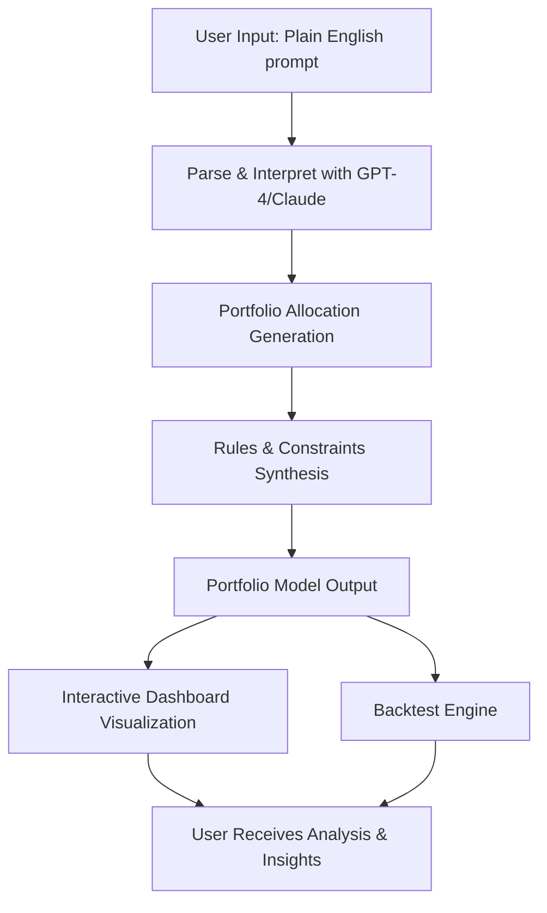

# 📊 GPT-Portfolio-Dash: Natural Language Portfolio Analyzer  
Effortlessly create and analyze fintech portfolios from natural language descriptions with AI-driven insights and generation.

---

## 🌟 Overview

**GPT-Portfolio-Dash** is a next-generation tool revolutionizing the way investors, analysts, and enthusiasts conceptualize, generate, and evaluate portfolio strategies. Describe your vision in everyday language — "A balanced 60/40 portfolio with ESG focus and quarterly rebalancing," or "Growth-focused tech asset allocation for aggressive risk" — and watch as the AI crafts detailed, executable allocation models, strategy rules, and dashboards.

Leverage advanced AI (OpenAI GPT-4 & Claude) to bridge the gap between human intuition and data-driven investment management. Intuitively design, test, and visualize your investment strategies in multiple languages with a few keystrokes.

---

# 🚀 Quick Start

Unlock the core features of portfolio analysis in moments. Get the latest binary or source code:

---

# 💡 Features at a Glance

- **Natural Language to Portfolio Model**: Describe your investment idea; get allocation weights, rules, and analytics instantly.
- **Automagic Strategy Generation**: Strategic rules, diversification logic, and risk models generated directly from your prompts.
- **Seamless Integration**: Connect to your favorite brokerage APIs and data providers (including TradingView, Yahoo Finance).
- **Insightful Dashboards**: Visualize allocations, time series, risk measures, ESG scores, and more — all generated for you.
- **Console & UI**: Use the beautiful, responsive web UI or the robust CLI tool.
- **Multilingual Support**: Full support for major world languages.
- **24/7 Proactive User Support**: Always-on digital helpdesk—get guidance, tips, and support anytime, anywhere.
- **Instant Portfolio Profiles**: Save and retrieve favorite portfolio setups, reusable for future tweaks or backtesting.
- **OpenAI GPT + Claude API Powered**: Leverage state-of-the-art natural language understanding and reasoning.
- **Advanced OS Compatibility**: Universal installer for all major platforms.

---

# 🌈 OS Compatibility Table

| OS          | Native UI | CLI Tool | Portfolio Data Import | Dashboard Rendering |
|-------------|:---------:|:--------:|:--------------------:|:------------------:|
| 🪟 Windows  |    ✅     |   ✅     |         ✅           |        ✅          |
| 🍎 macOS    |    ✅     |   ✅     |         ✅           |        ✅          |
| 🐧 Linux    |    ✅     |   ✅     |         ✅           |        ✅          |
| 📱 iOS Web  |    ✔️    |   N/A   |         ✔️          |        ✔️         |
| 🤖 Android Web|  ✔️     |   N/A   |         ✔️          |        ✔️         |

---

# 🌐 Example Profile Configuration

Below is an example of a GPT-Portfolio-Dash profile for a custom investment approach.

json
{
  "profileName": "AggressiveTech2026",
  "description": "High-growth technology-focused portfolio for 2026, with automated quarterly rebalancing and 10% ESG allocation.",
  "assetClasses": [
    {"name": "US Tech Equities", "weight": 0.60},
    {"name": "Emerging Market Tech", "weight": 0.20},
    {"name": "Green Energy ETFs", "weight": 0.10},
    {"name": "Cash Equivalent", "weight": 0.10}
  ],
  "rebalanceFrequency": "Quarterly",
  "riskProfile": "Aggressive",
  "esgIntegration": true,
  "multiLanguageSupport": "en, es, zh, fr"
}

---

# 🖥️ Example Console Invocation

Invoke the tool on your favorite shell to turn your natural language brief into a full, actionable portfolio strategy:

bash
gpt-portfolio-dash analyze "Balanced ESG global equities portfolio with 70% equities, 20% bonds, and 10% gold, rebalanced every 6 months"

You’ll get:

- Portfolio allocation breakdown (JSON and interactive chart)
- Strategy rules in human-readable form
- Risk/return diagnostic summaries
- Backtest-ready code snippet

---

# 🌍 Multilingual Support

| Language     | Supported | Details                      |
|--------------|-----------|------------------------------|
| English      |   ✅      | UI, API, docs                |
| Español      |   ✅      | UI, API                      |
| 中文         |   ✅      | UI, API                      |
| Français     |   ✅      | UI, docs                     |
| Deutsch      |   ⚡️      | Partial (CLI only)            |
| 日本語        |   ⚡️      | Partial (CLI only)            |

Custom translations are synchronously improved via community suggestions.

---

# 💬 AI Services Integration

| Service                   | Usage                   |
|---------------------------|-------------------------|
| OpenAI GPT-4              | Natural language → Portfolio models, risk analysis, summary explanations |
| Anthropic Claude          | Enhanced risk diagnostics, complex scenario backtesting |
| Local AI Model Option     | (for advanced users) Offline private data, microservices support |

Everything is prompt-optimized for the ultimate fidelity and operability.

---

# 🎯 SEO-Friendly Keywords

- portfolio generation from plain English
- AI-driven portfolio optimizer and analyzer
- interactive investment dashboard automation
- multi-language portfolio design tool
- GPT-4 portfolio strategy generator
- Claude API financial modeling integration
- real-time allocation rule generation
- responsive cross-platform investment utilities
- 24/7 digital portfolio support
- ESG investment strategist automation

Experience the edge in modern portfolio creation using the power of language, artificial intelligence, and robust analytics.

---

# 📈 Mermaid Diagram: Workflow

---

# 🛠️ Unique Features

- **Conversational Portfolio Creation**: Transform simple intentions into advanced financial constructs.
- **Always-On Support**: 24/7 chatbot and ticketed support for troubleshooting and best-practices, tailored to your needs.
- **Insightful Visualizations**: Dynamic, interactive charts and analytics crafted through AI.
- **ESG-First Options**: Deep integration of sustainability considerations in every portfolio suggestion.
- **Multilingual Magic**: Switch the UI and reports seamlessly between languages.
- **Platform Harmony**: Highly responsive web experience—plus a powerful CLI for automation professionals.
- **Plug & Play API**: Build or extend with well-documented endpoints for integration into in-house workflows.

---

# ⚠️ Disclaimer

This project is designed for educational, prototyping, and research purposes. The portfolio allocations and outputs are generated **by artificial intelligence** and should not be construed as professional investment, legal, or tax advice. Always consult a qualified financial advisor for actual investment decisions. All data, analysis, and AI outputs are provided *as-is*, for informational purposes only. 

**By using GPT-Portfolio-Dash, you acknowledge these limitations and agree to use the tool responsibly.**

---

# 📄 License: MIT

Simple, permissive, and open.

[MIT License Full Text](https://opensource.org/licenses/MIT)

---

# 🏁 Getting Started & Downloads

For a seamless start, grab the latest release:

Clone, fork, or adapt for your own next-generation portfolio innovation.

---

#### © 2026. All rights reserved. GPT-Portfolio-Dash – The Language of Investment, Redefined.